人脸标注工具
============

本章对人脸标注工具的使用作出说明。当切换图片次数较多时，会有背景被历史图片覆盖的问题，目前没有很好的解决方法，但不影响标注结果，出现该情况如无法忍受重新打开即可。人脸标注工具包括以下四个区域：

1)  人脸图像区域

2)  关键点数据区域

3)  人脸属性区域

4)  其他功能区域

四个区域分别如下所示：

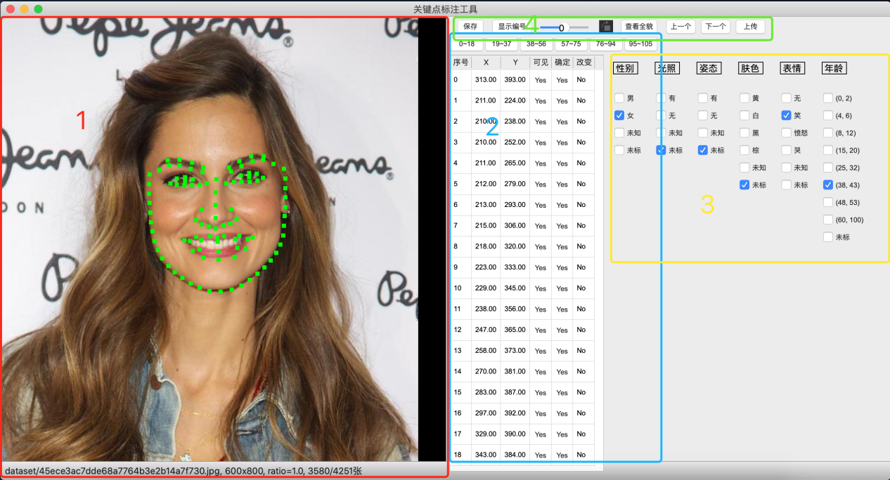

图1-1 标注工具示例图

人脸图像区域
------------

人脸图像区域分为两个子部分：图片操作和关键点操作。

### 图片操作

该操作支持鼠标的拖拽（左键单击图片某个位置，按住向某个方向移动），放大缩小（用鼠标的滚轮前后滑动，该缩放最小尺寸是原图尺寸，最大尺寸是原图×10）。下图如放大示例图，最下方有放大倍率（rate=2.0代表放大到×2）提示：

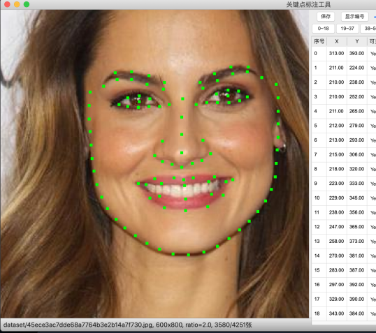

图1-2 图片放大2倍

拖拽到图片边缘时，会有黑色的缓冲区域，这部分区域代表已经超出图片范围，如图1-3。

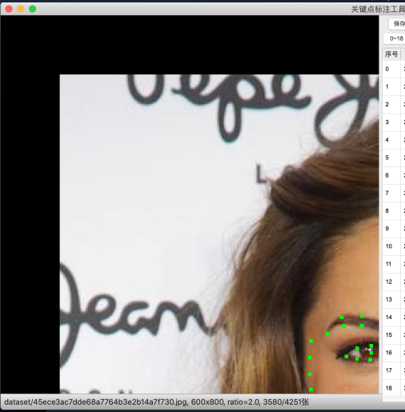

图1-3 拖拽至图片左上角边缘

### 关键点操作

关键点也可以做拖拽（左键点击关键点并移动鼠标），也可以通过"ESC"键复原当前调整的点为原始位置。关键点是一个正方形的小格子，**他的左上角位置代表该点的坐标**。关键点的颜色代表它的各种状态，如图1-4：

1)  绿色：最普通的颜色，代表它没有被鼠标选中且可见的状态。

2)  红色：被鼠标选中的点，可以通过键盘↑、↓、←、→像素点级别地移动它。

3)  蓝色：标记为"该点不可见"（通过"关键点数据区域"来设置）。

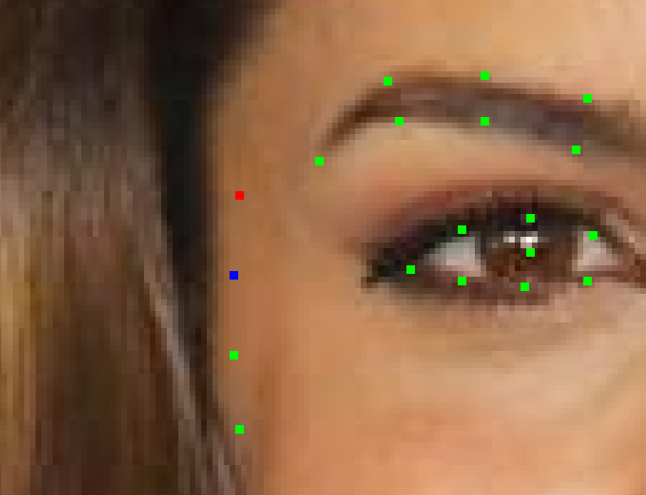

图1-4

关键点数据区域
--------------

关键点数据区域在人脸图像区域的右侧，表格部分有6列，依次为：

1.  序号：代表关键点的序号。

2.  X：表示关键点的横坐标。

3.  Y：表示关健点的纵坐标。

4.  可见：代表该点是否可见（Yes代表可见，No代表不可见），遇到遮挡以及其他看不见的情况会被标记成不可见，鼠标只需要点击这一列的对应位置，可触发Yes和No的相互转换。

5.  确定：默认是Yes（**点被设成不可见的时候默认变为No**），如果遇到关键点位置不确定，这将这一项设成No，此时方法与"可见"一样。

6.  改变：默认是No，如果该点的坐标改变，相应位置则会变成Yes，如果需要复位，点击该位置即可。

如图1-5，欲使25号点设置成不可见，则点击红色区域，则转为不可见；欲使25号点设置成不确定，则点击蓝色区域；欲复原25号点，则点击绿色位置。

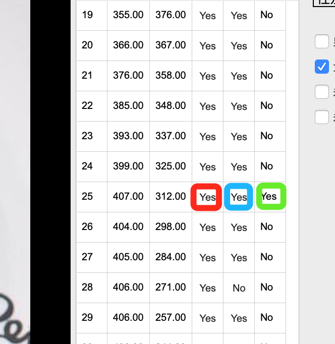

图1-5 关键点数据区域操作

如果在人脸图像区域选中了一个点，则在关键点数据区域也会有一个高亮的标识来提示用户正在修改哪个点的数据。如图1-6，挪动31号关键点。

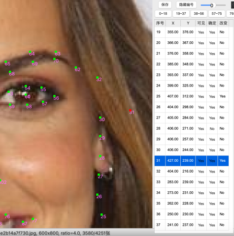

图1-6 挪动31号关键点

也可以通过点击序号位置来使对应序号的关键点变成"被选中"模式，从而使其具有可以通过键盘移动和颜色变红的特性。

关键点数据区域的表格只能显示一部分关键点（如第一页只有0\~18号的关键点），所以如果想观看其他部分，需要做翻页。图1-7为关键点索引，可以点击它对当前表格做"翻页"。

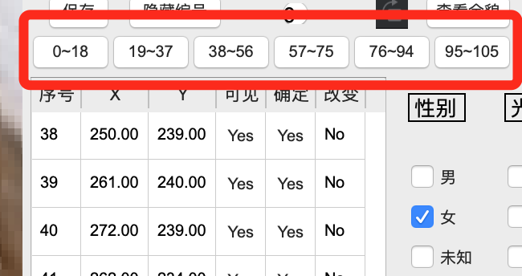

图1-7 关键点索引

人脸属性区域
------------

人脸属性区域在关键点数据区域的右侧。属性中有一个通用选项叫"未标"，代表预读取的标注数据中并没有该属性的记录；属性中"未标"、"未知"和其他属性属于互斥关系，而其他属性之间支持多选，比如年龄如果同时选择了(25,32)，(38,43)，就代表中当前人脸的年龄在这两个区间内。目前有以下几个属性（后续可能还有调整）：

1. 性别：选择"男"或"女"，不确定男女的时候可以选"未知"。

2. 光照：强烈曝光或特别黑的时候可以选"有"，默认"无"。

3. 姿态：人脸抬头低头、向左右偏转的时候选择"有"，默认"无"。

4. 肤色：如不确定则选未知。

5. 表情：如面无表情则选无。

6. 年龄：如不确定的范围比较大，则可以多选几个范围。如果觉得是23岁，则需要选上(15,20)和(25,32)。

   如下图1-8。

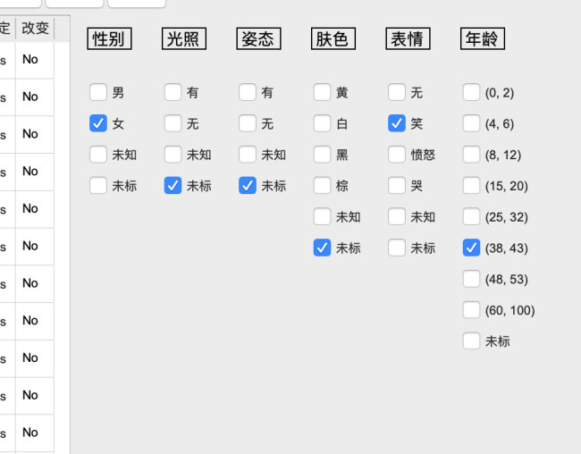

图1-8

其他区域
--------

### 其他信息显示区域

该区域位于"人脸图像区域"正下方，用于一些信息显示，辅助使用者。信息内容是：图片路径，原图宽×原图高，rate=放大倍率，该使用者标注人脸数/所有使用者标注人脸总数。如下图1-9的红框标出位置。

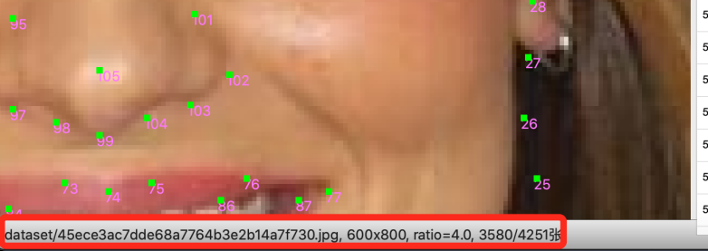

图1-9 其他信息显示区域

### 辅助功能区域

该区域位于工具右上角，如图1-10，从左到右依次是：

1.  保存：**在上传前需要保存。**保存这步只是把它保存在本地了，后面发现需要调整，可以多次保存。

2.  显示编号：可以让"人脸图像区域"的关键点显示它们的编号。点击之后，该按钮变成了"隐藏编号"，二次点击则还原。

3.  亮度调节条：通过滑动拉条控制"人脸图像区域"的图像亮度，当它是0的时候代表是原图亮度。如果标注时，

4.  旋转按钮：点击该按钮，图像逆时针旋转90°。一般人脸旋转角度比较大的时候可以考虑该功能。

5.  查看全貌：点击该按钮时，会弹出一个带原图的小框，可以鼠标拖拽放大缩小，在标注时，需经常用该功能来判断当前标注的地方有无问题（这个小框的效果就是最终的效果）。

6.  上一个：点击该按钮可以翻到这张图的上一张人脸，但是需要注意的是，跳转之后会刷新成最初点的样子，但如果本张人脸已经保存过，则不会受影响。如果没有保存，则会提示，如图1-11。

7.  下一个：点击该按钮可以翻到这张图的下一张人脸，但是需要注意的是，跳转之后会刷新成最初点的样子，但如果本张人脸已经保存过，则不会受影响。如果没有保存，则会提示，如图1-11。

8.  上传：在保存之后可以点击该按钮，把本地存储好的标注缓存上传到云端。如果没有保存到本地的话，点击"上传"会有提示，如图1-12。如果点击"是"上传的话，则会忽略本张人脸（如果本张图片没有保存过任何人脸的话，则会上传一个空数据）。

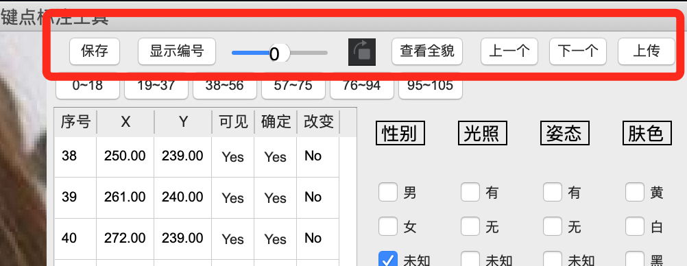

图1-10 辅助功能区域

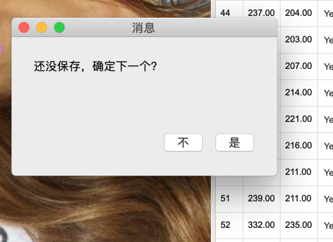

图1-11

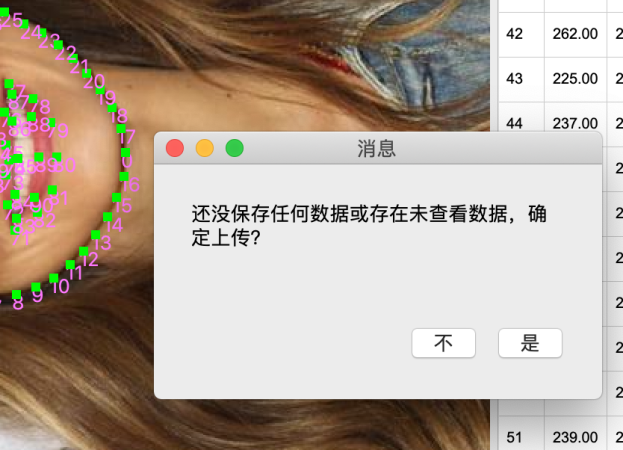

图1-12