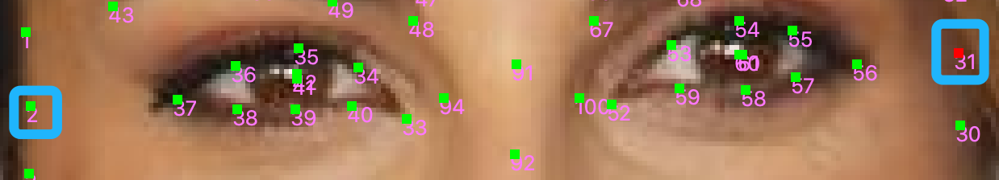
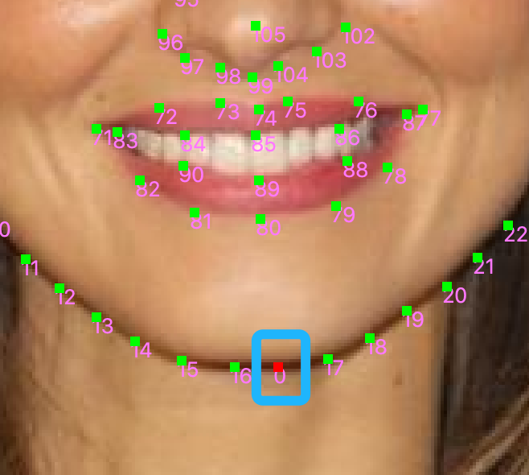
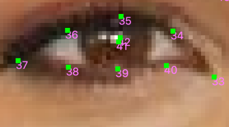
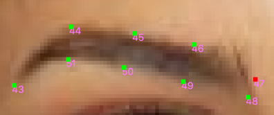
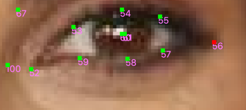
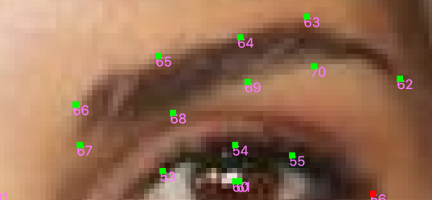
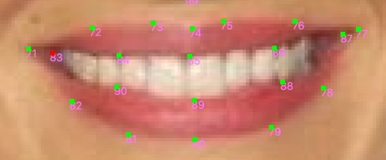
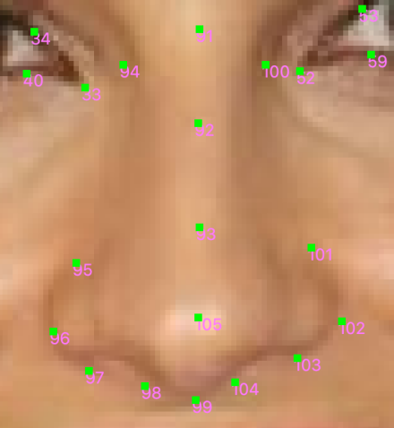

### 关键点位置的大体分布

以正脸的人脸位置为例，如图2-1。

图2-1

1.  \[0-32\]是脸部轮廓，其中\[1-16\]是左半脸\[17-32\]是右半脸。

2.  左眼\[33-42\]，左眉\[43-51\]。

3.  右眼\[52-61\]，右眉\[62-70\]。

4.  嘴巴\[71-90\]，其中外圈是\[71-82\]，内圈是\[83-90\]。

5.  鼻子\[91-105\]，其中鼻梁\[91-93\]，轮廓\[94-104\]，鼻尖\[105\]。

### 特殊关键点

在106个关键点里，有一些点是用于描述一些轮廓边界，且使其更平滑的普通点，也有一些具有定位意义的重要点，被称为特殊关键点。接下来介绍这些关键点，为了方便描述不同序号的关键点，比如32号点，写作32。

a.  2和31是一对对称点，他们约位于与眼角平行的外侧位置，如图2-2。

图2-2

b.  0是下巴的中心点，如图2-3。

图2-3

c.  33和37分别为左眼的左右眼角，35和39分别为左眼的上下眼轮廓中心，41是眼部中心点（这个点可以忽略，不需要特别管他，不影响），42是瞳孔的位置，如图2-4。

图2-4

d.  43是左眉尖的那个点，44和51是接近左眉尖的那个拐点，47和48是左眉另一端边缘的两个点，如图2-5。

图2-5

e.  52和56分别为右眼的左右眼角，54和58分别为右眼的上下眼轮廓中心，60是眼部中心点（这个点可以忽略，不需要特别管他，不影响），61是瞳孔的位置，如图2-6。

图2-6

f.  62是左眉尖的那个点，63和70是接近左眉尖的那个拐点，66和67是左眉另一端边缘的两个点，如图2-7。

图2-7

g.  71和77是嘴唇的外嘴角，73-74-75分别为外嘴唇上部的凸起部分，80是外嘴唇下边缘的中心位置，83和87是内嘴角，85和89分别为内嘴唇中上下边缘的中心点，如图2-8。

图2-8

h.  91-92-93是鼻梁的连线，94和100是鼻子边缘的位置（如果不是很偏，通常不需特意调整），97和98是左鼻孔下方的左边界和右边界，104和103是右鼻孔下方的左边界和右边界，99是鼻子下方正中央的点，95和101是鼻翼尽头的地方，105是鼻尖（**鼻子最需要标注正确的一个点**），如图2-9。

图2-9