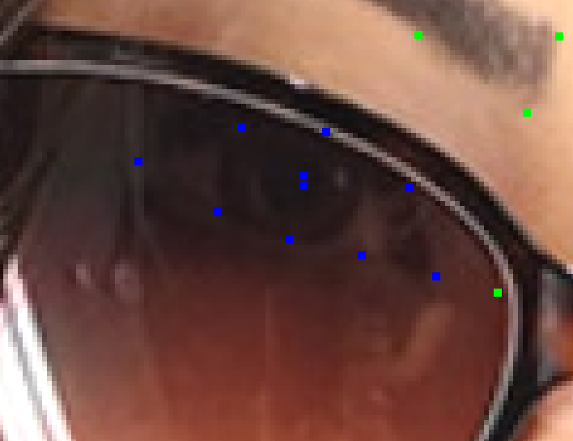
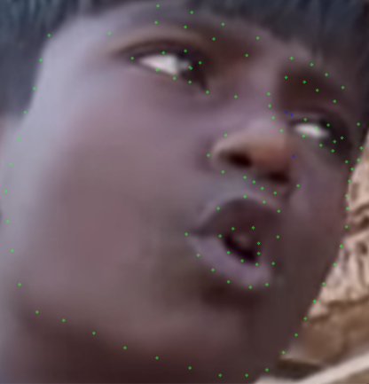
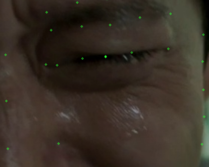
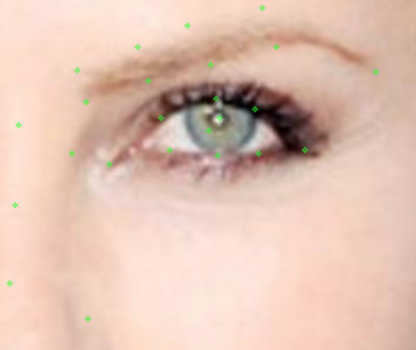
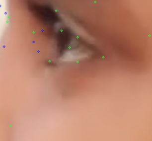
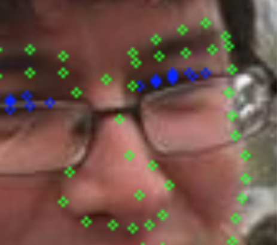

# 眼部 

戴墨镜的时候，一般不可见的点也会被设成不确定，但如果透过墨镜可以隐约看到眼部的位置的话，将那些确定位置的点设置成确定。
 
当眼睛往一侧看的时候，瞳孔的位置需要调整到相应位置。

当眼睛闭上的时候，需要把上眼皮和下眼皮的点重在一起，上眼皮中心点和下眼皮中心点最好与瞳孔重合。

眼角的点是沿着眼皮走的，而非眼球，这个问题很常见。 

对于侧脸的眼睛，只需要把看不见的那部分设为不可见，然后把眼皮中间点挪到最边缘就ok（因为侧脸眼睛的左边界基本是眼皮的中心位置）

由于戴眼镜导致折射，眼睛区域的轮廓会使得整个轮廓曲线不平滑，因此将眼睛区域的点设成**不确定**

  