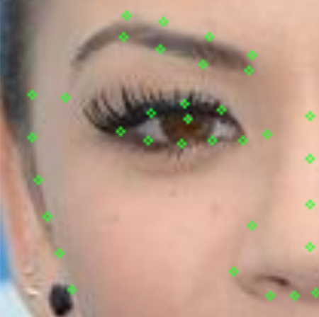
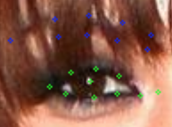
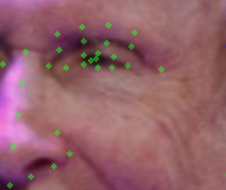
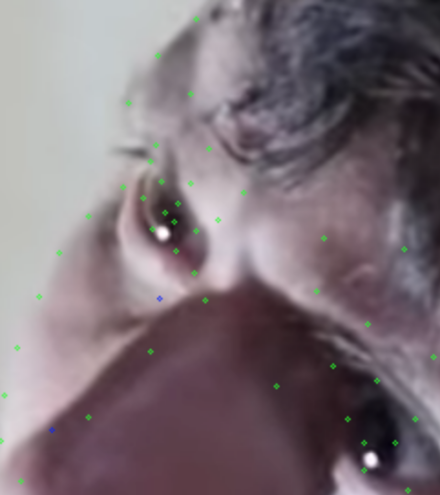
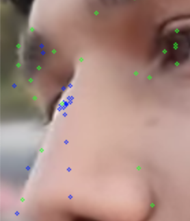
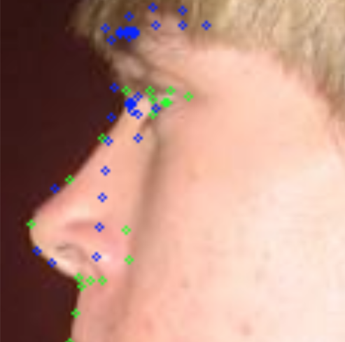

# 眉毛

------ ----------------------------------------------------------------------------------------------------------- ------------------------------------------------------------------------------------

| 问题描述                                                     | 示例图                 |
| ------------------------------------------------------------ | ---------------------- |
| 眉毛尖那个点需要移动到最后那段可以看到它的位置，哪怕它颜色已经比较淡了。 |  |
| 对于眉毛被遮挡的这种情况，需要设置成不可见，但如果大致可以推断被遮挡的点所在位置，可以把确定设置成"Yes"。 |  |
| 对于一些老人或婴儿，常常有找不到眉毛的时候。无须再调动关键点位置，只要把它们都设置成不确定就好了. |  |
| 遇到这种侧脸，眉尖看不见但眉毛又露出很大部分的情况，就直接标到眉毛边缘的中央位置就可以。 |  |
| 对于一些眉毛露出较少的，可以只塞三对点，甚至两对，剩下的点对和眉尖设置不可见即可。 |  |
| 对于一些完全看不见某个部位的情况，可以直接设置成不可见&&不确定，位置不需要再调动 |  |