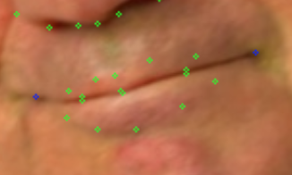
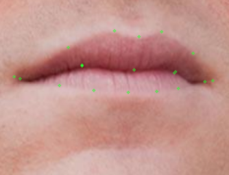
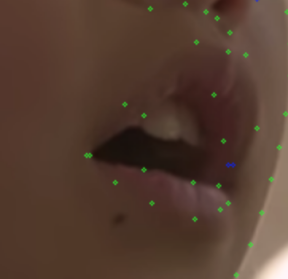
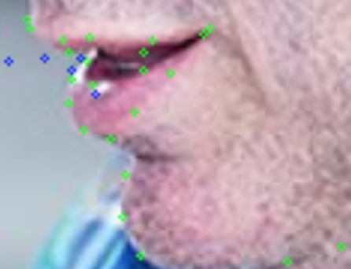

# 嘴巴

------------------------------------------------------------------------------------

| 问题描述                                                     | 示例图                 |
| ------------------------------------------------------------ | ---------------------- |
| 如果嘴角闭合，则内嘴角和外嘴角重合，且内嘴角设为不可见（确定与否根据具体情况而定，一般设为确定即可） |  |
| 如果明显能看得到内外嘴唇的嘴角不重叠，则分别标注就可以       |  |
| 张大嘴时，如果口腔内部过于暴露，漏出过多里面红色的部分，则内轮廓依然以嘴唇大致位置为准，如下图中内侧嘴唇的上嘴唇 |  |
| 如果面部旋转角度比较大，则根据特殊点的位置是否可见来判断每个点的位置及可见属性 |  |