# 面部轮廓

------ ------------------------------------------------------------------------------------------------------------------------ ------------------------------------------------------------------------------------

| 问题描述                                                     | 示例图                 |
| ------------------------------------------------------------ | ---------------------- |
| 当抬下巴，成下图这样的形状时，需要也将关键点调到相应位置     | 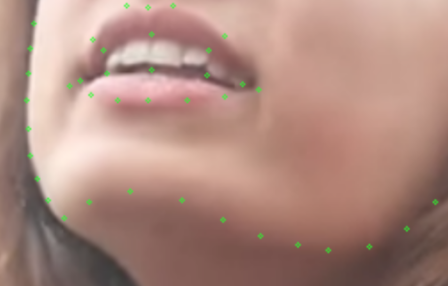 |
| 尽量轮廓围绕鬓角的头发（如果这种标法导致曲线特别奇怪，就不刻意追求） | 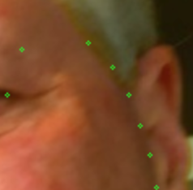 |
| 对于鬓角部分轮廓看不见的情况，需要设置成不可见               | 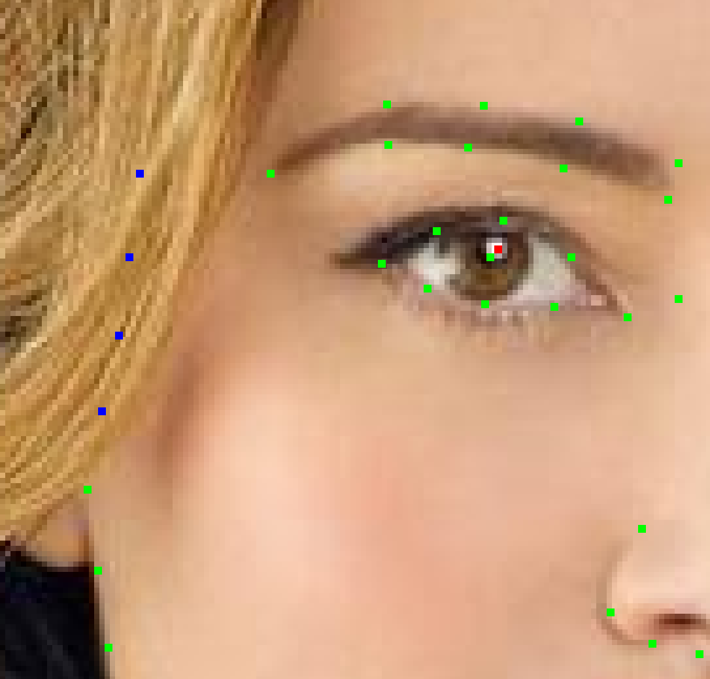 |
| 对于大胡子，下巴需要设置成不可见，但如果有局部点可以确定位置，则将确定设置成"Yes" | 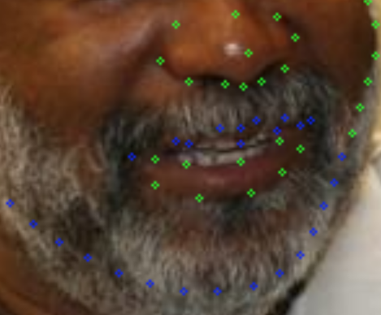 |
| 对于这类轮廓不明显的情况，沿着轮廓明显的下巴标记，与贴着耳朵的部分连成平滑的弧线。 | 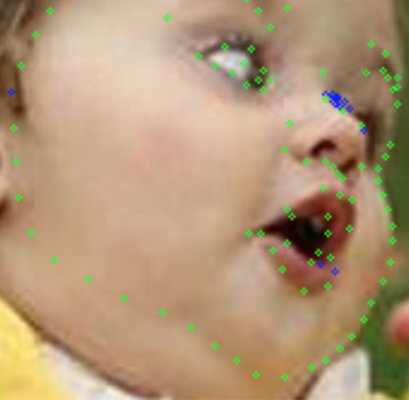 |
| 对于类头发严重遮挡切不确定界限在哪的，直接设成不可见&&不确定就可以了，不需要再花时间去移动这些点到近似的位置。 | 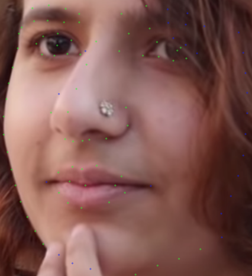 |
| 当头发沿着很柔滑的线路覆盖脸颊时，很容易被当成是真的脸部轮廓。所以应多多利用"查看全貌"的按钮，这里需要着重注意。 | 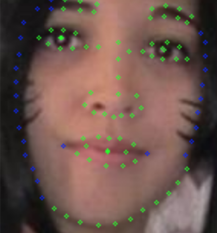 |
| 对于过暗的地方看不见的话也可以设置成不可见，对于一切看不到的部位都可以设置成不可见，不一定非要遮挡。 | 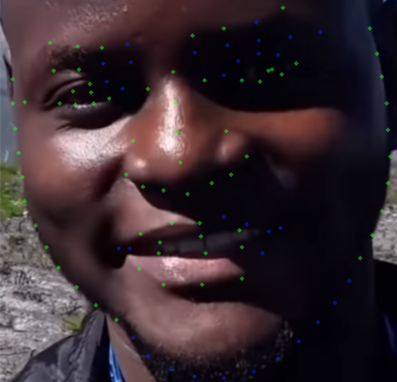 |
| 如果出现脸有部分在图片外，直接把对应的点挪到图片外的黑色填充区域，即可，不需要设置成不可见 | 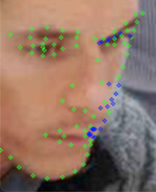 |
| 这种情况轮廓出现最多但不限于轮廓，遇到一些遮挡时，常常在遮挡边缘那个点可以大概确定位置，因此需要在设置成不可见&&确定。 | 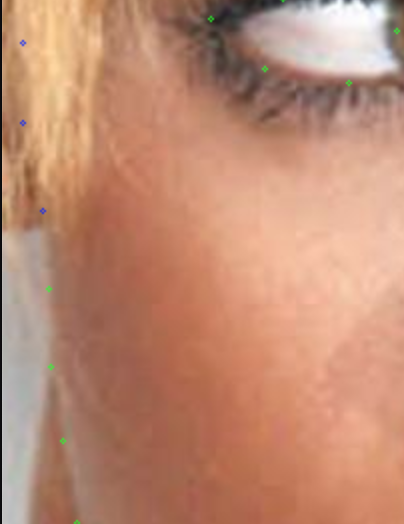 |
| 对于露出下巴下方的肉块，不能将它当下巴。                     | 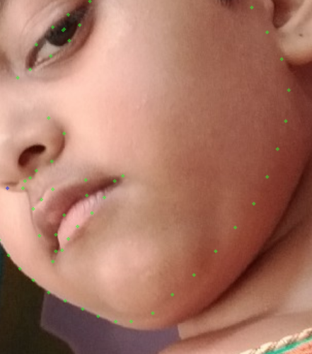 |
| 遇到这种标注完全不对的情况，可以选择跳过（直接点【下一张】人脸，如果当前图片就这一张人脸，则【上传】） | 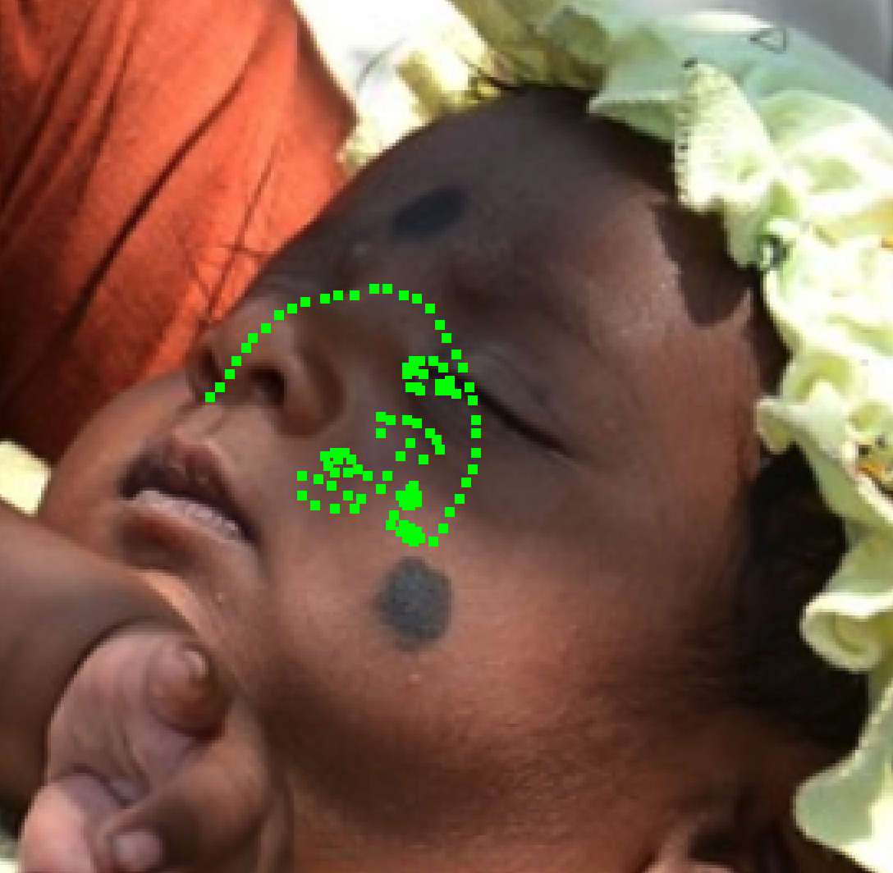 |

